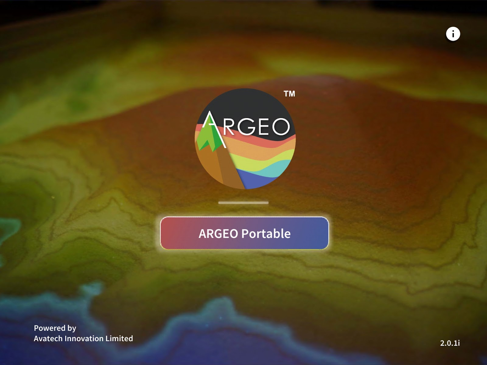

關於 ARGEO Portable Application
========

About the Product

|Logo| |Landing|

**ARGEO Portable** 是一個結合地理教學資源的應用程式，透過地形塑造，模擬出真實立體地理環境。同時，新版本加入了班級管理系統，分開教師帳戶及學生帳戶，而所有空間則會儲存於雲端系統內，使用過程中需保持網絡連接。供老師分享螢幕到 ZOOM/GOOGLE MEET 等遙距教學應用程式幫助老師進行遠程教學。

功能清單
************

.. |Logo| image:: images/Logo.png
  :width: 200
  :alt: Logo

