面積 Area
===================================

.. |preset_terrain| image:: area_images/preset_terrain.png
   :width: 30

.. |terrain_edit_mode| image:: area_images/terrain_edit_mode.png
   :width: 30

.. |mapview| image:: area_images/mapview.png
   :width: 30

.. |get_ruler| image:: area_images/get_ruler.png
   :width: 30

.. |horizontal_ruler| image:: area_images/horizontal_ruler.png
   :width: 30

.. |vertical_ruler| image:: area_images/vertical_ruler.png
   :width: 30

.. |viewmode| image:: area_images/viewmode.png
   :width: 30

.. |environment_options| image:: area_images/environment_options.png
   :width: 30

.. |get_ruler| image:: area_images/get_ruler.png
   :width: 30

教學指引
*********

以下示範如何以 ARGEO Portable 教導面積單元。

**計算規則形狀物件的實際面積**
**Calculate the actual area of regular-shape object.**

a. 選擇一個「預設地形(Preset Terrain) |preset_terrain|」或使用「地形塑造 |terrain_edit_mode|」功能建設一個地形，以下以在「地圖Map B」計算E塘的實際面積為例子。

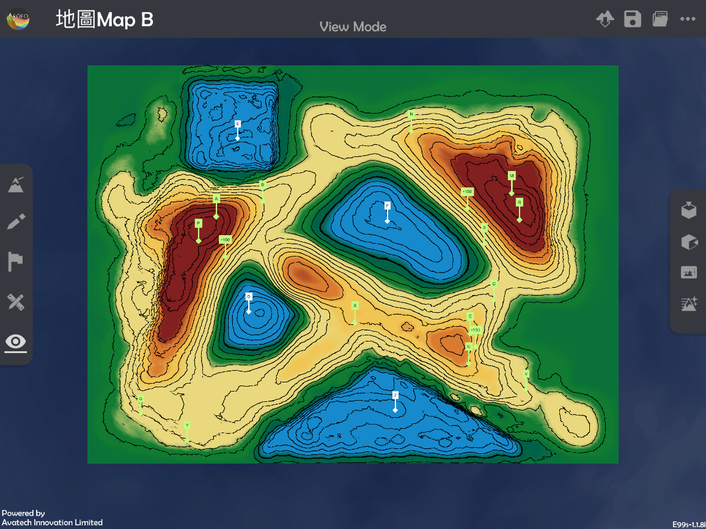

b. 使用「地圖介面 |mapview|」。

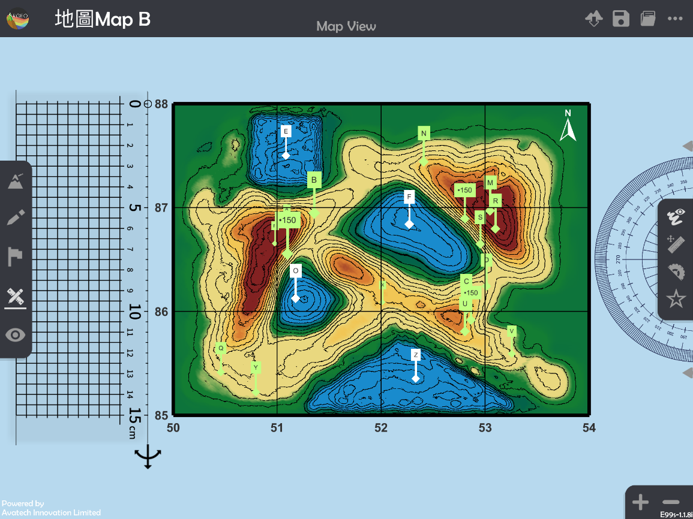

c. 按「呼喚直尺」|get_ruler|。

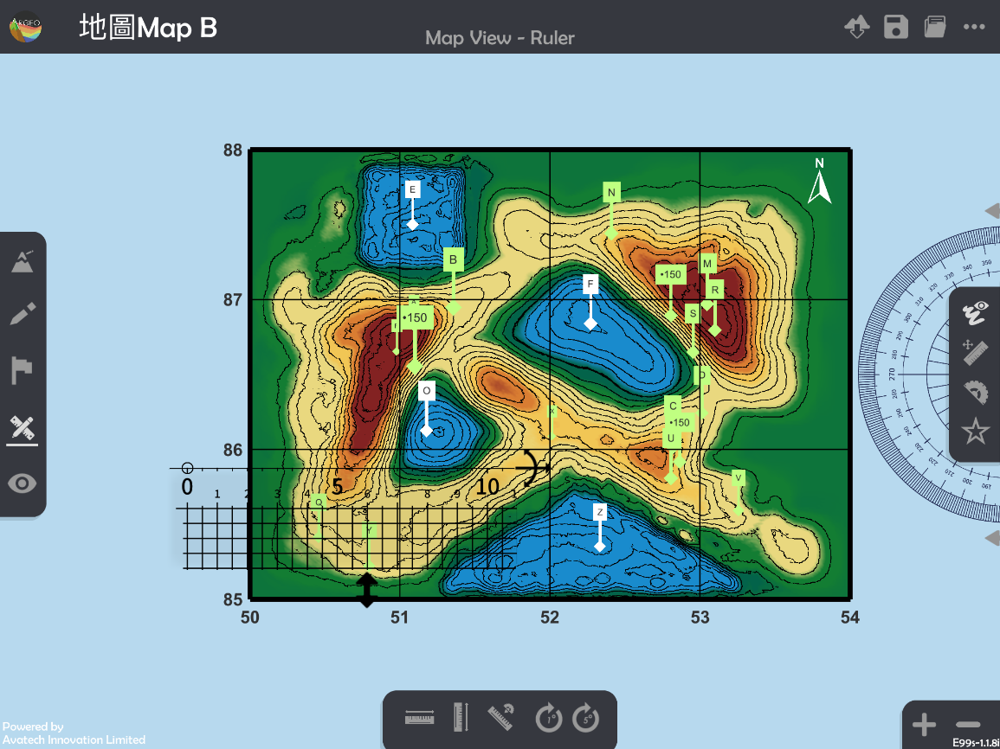

d. 放置和調校直尺以量度圖案的長和闊。

   *可按「水平直尺 |horizontal_ruler|」和「垂直直尺 |vertical_ruler|」以調整直尺至水平或垂直。

   *可按「放大」和「縮小」以調整地圖介面，減小誤差。

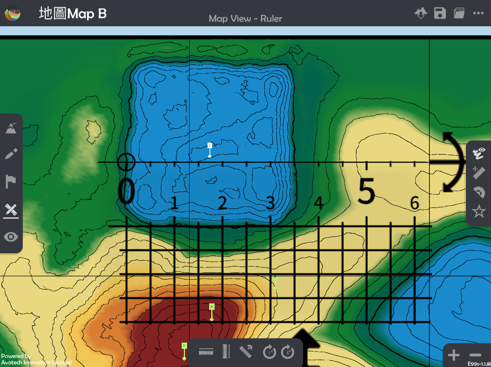

e. 計算實際面積。

**計算不規則形狀物件的實際面積**
**Calculate the actual area of irregular-shape object.**

a. 選擇一個「預設地形(Preset Terrain) |preset_terrain| 」或使用「地形塑造 |terrain_edit_mode|」功能建設一個地形，以下以在「地圖Map B」計算格網方格5286、5287、5386及5387中深啡色山體的部份的實際面積為例子。

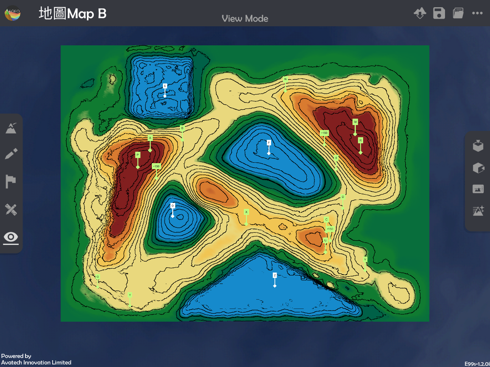

b. 使用「地圖介面 |mapview|」。

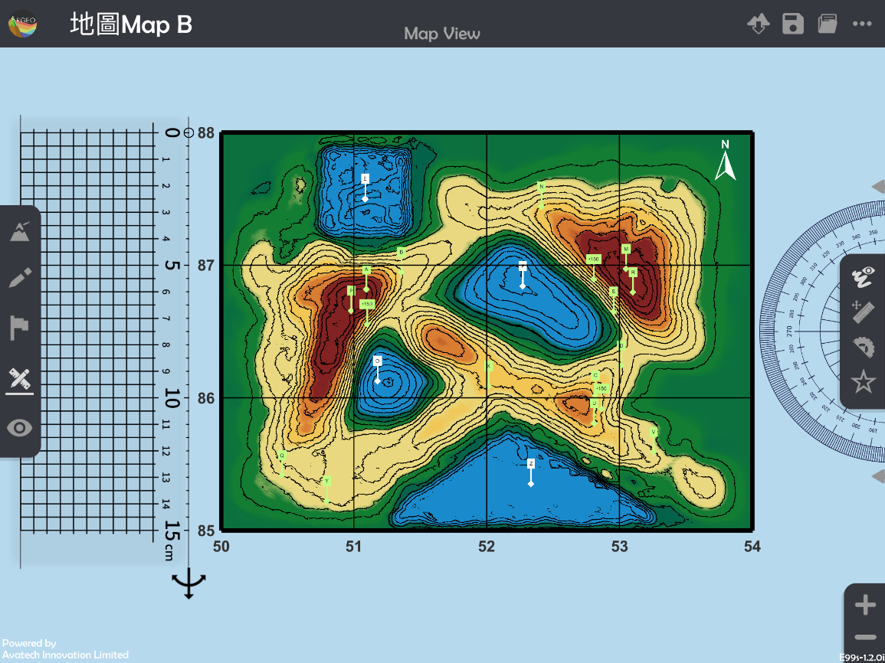

c. 選擇「繪圖工具 |pen|」，並勾畫出想量度的面積。

*不建議使用白色繪畫，因在隨後的步驟會難以計算面積。

*可按「放大」和「縮小」以調整地圖介面，減小誤差。

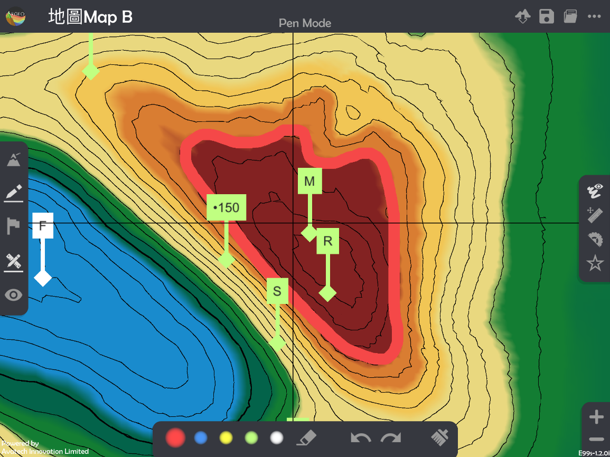

d. 使用「觀察模式 |viewmode|」。

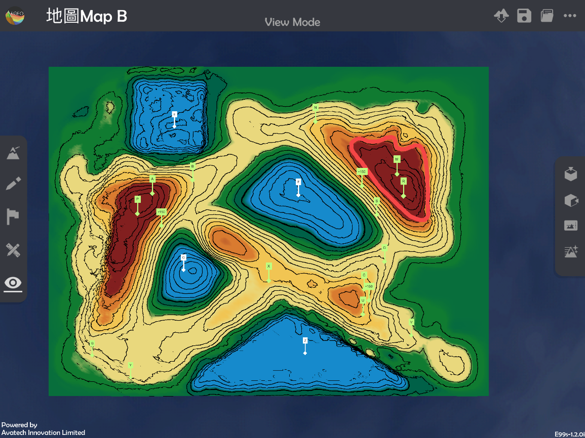

e. 選擇「環境調整 |environment_options|」，並在地貌顏色選擇黑白色 |black_white|。

.. image:: area_images/area9.png
  :width: 600
  :alt: Alternative text

f.  使用「地圖介面 |mapview|」。

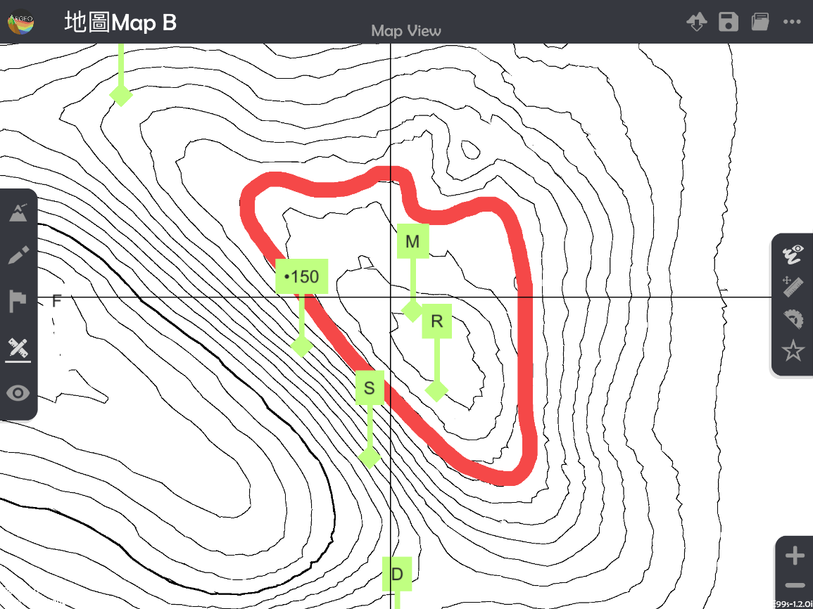

g. 按「呼喚直尺 |ruler|」。

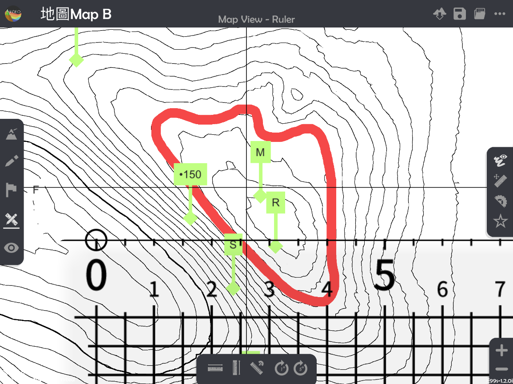

h. 把直尺上的方格覆蓋在物件上。

*應把直尺調校至取得最多的完整方格。

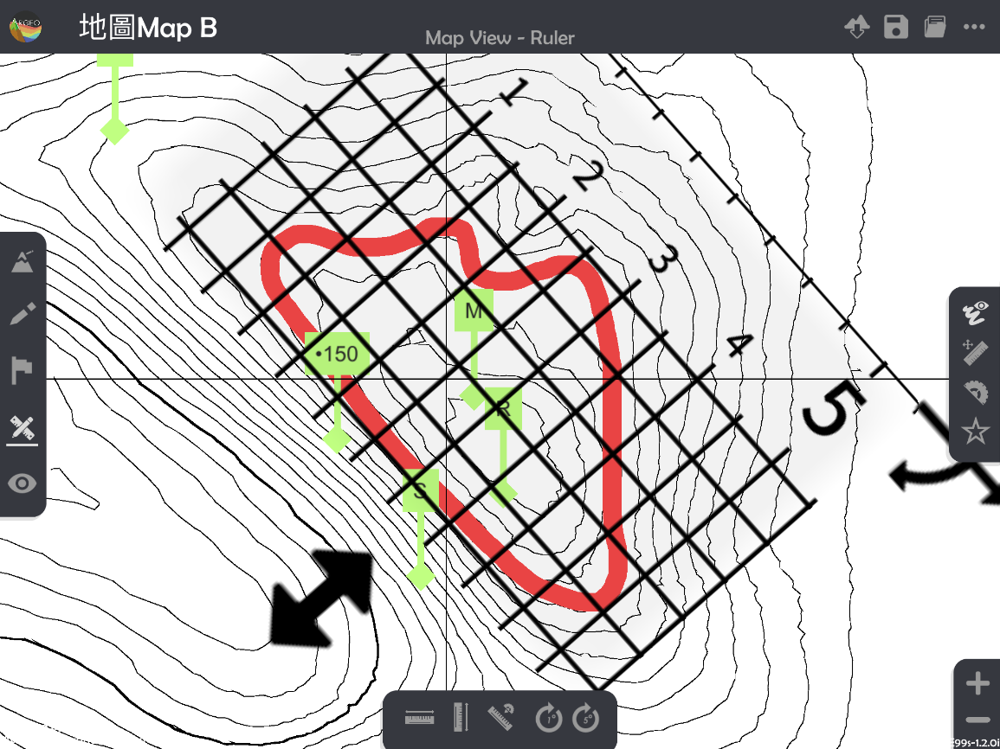

i. 數點完整方格及不完整方格的數目。

*紅色數字為完整方格、藍色數字為不完整方格。

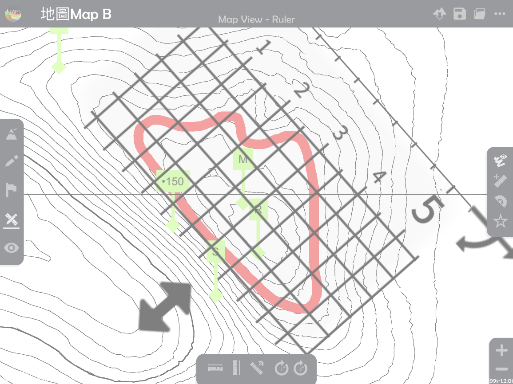

j. 計算總格數。

k. 計算實際面積。

下載教學資源
***************
教學指引
`按此下載 <https://drive.google.com/file/d/12R2nXGHdFn0_I3p5RI03WZq74EA9_uQm/view?usp=sharing>`_

工作紙及答案(中文版)
`按此下載 <https://drive.google.com/drive/folders/18h0_oens_dF2TVBg6NXzF3qyvsLnN0dz?usp=sharing>`_

工作紙及答案(英文版)
`按此下載 <https://drive.google.com/drive/folders/1-6cRwc3f9oWaqignF0yTBubCasHDZqD6?usp=sharing>`_

