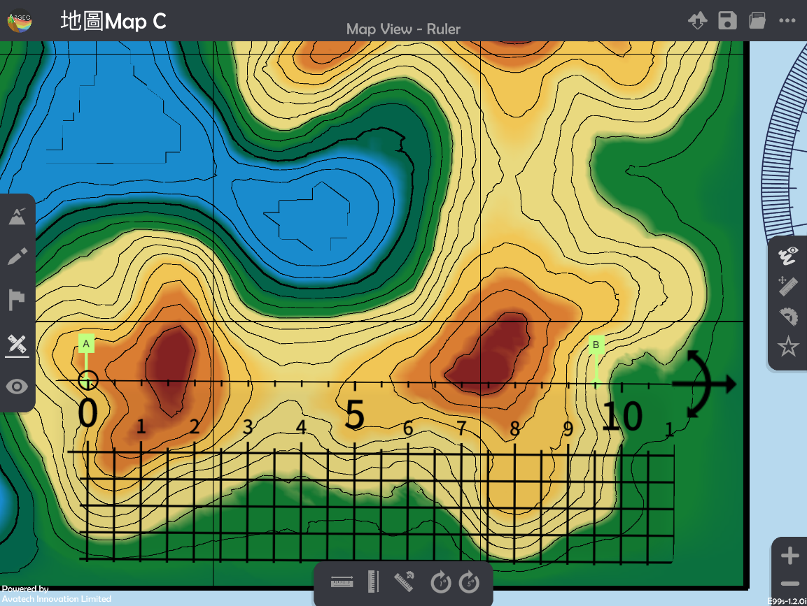
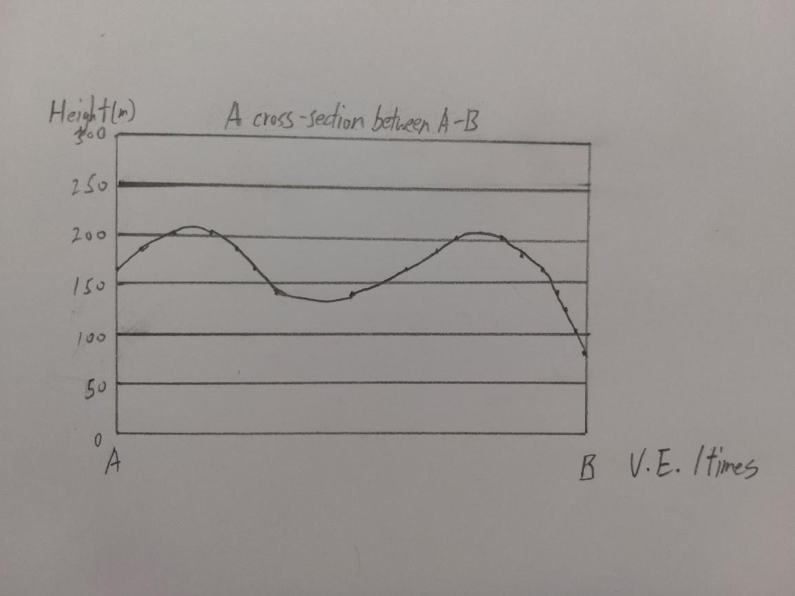

橫切面 Cross-section
===================================

.. |preset_terrain| image:: cross_section_images/preset_terrain.png
   :width: 30

.. |terrain_edit_mode| image:: cross_section_images/terrain_edit_mode.png
   :width: 30

.. |mapview| image:: cross_section_images/mapview.png
   :width: 30

.. |get_ruler| image:: cross_section_images/get_ruler.png
   :width: 30

.. |cross_section| image:: cross_section_images/cross_section.png
   :width: 30

教學指引
*********

以下示範如何以 ARGEO Portable 教導橫切面單元。 

The following demonstration shows the teaching procedures of cross-section by using ARGEO Portable. 

a. 選擇一個「預設地形(Preset Terrain) |preset_terrain|」或使用「地形塑造 |terrain_edit_mode|」功能建設一個地形，以下以在「地圖Map C Preset Terrain」繪畫A點到B點的橫切面圖為例子。
   
   Select a landform from “Preset Terrain |preset_terrain|” or use “Terrain Modifying |terrain_edit_mode|”function to create a landform. The following example is to draw a cross-section from point A to B in “地圖Map C Preset Terrain”.

.. image:: cross_section_images/cross_section1.png
  :width: 600
  :alt: 登入畫面

b. 使用「地圖介面 |mapview|」。

   Apply “Map View |mapview|”.

.. image:: cross_section_images/cross_section2.png
  :width: 600
  :alt: 登入畫面

c. 按「呼喚直尺 |get_ruler|」。

   Apply “Get Ruler |get_ruler|”.

.. image:: cross_section_images/cross_section3.png
  :width: 600
  :alt: 登入畫面

d. 放置和調校直尺連接AB兩點。

   Place and adjust the ruler on Point A and B.

e. 將AB兩點所穿過的等高線記錄在現實的紙條和直尺上。

   Record the height of contour lines across the Point A and B on a piece of paper and ruler in real life.

.. image:: cross_section_images/cross_section5.jpg
  :width: 600
  :alt: 登入畫面

f. 利用已記錄高度的紙條繪畫橫切面圖。

   Draw the cross-section with the paper which records the height.

g. 使用「觀察模式 |viewmode|」。

   Apply “View Mode |viewmode|”.

.. image:: cross_section_images/cross_section7.png
  :width: 600
  :alt: 登入畫面

h. 按「橫切面 |cross_section|」，並使用滑桿標調整橫切面位置和垂直誇大率，核對手繪橫切面圖。
   
   Select “Cross-section |cross_section|” and use the slider to adjuct and position of cross-section and vertical exaggeration to check the cross-section.

.. image:: cross_section_images/cross_section8.jpg
  :width: 600
  :alt: 登入畫面 

下載教學資源
***************
教學指引
`按此下載 <https://drive.google.com/file/d/1NqomonxqYHCGY8Ax197AUrpfoD0nG9lD/view?usp=sharing>`_

工作紙及答案(中文版)
`按此下載 <https://drive.google.com/drive/folders/1ILmQLdeMXUSZbcGZqvOPCQjOST6Sn0uh?usp=sharing>`_

工作紙及答案(英文版)
`按此下載 <https://drive.google.com/drive/folders/1Z0cfZKpeVzPHsX-sQse7sn7cYLWWFG1_?usp=sharing>`_

