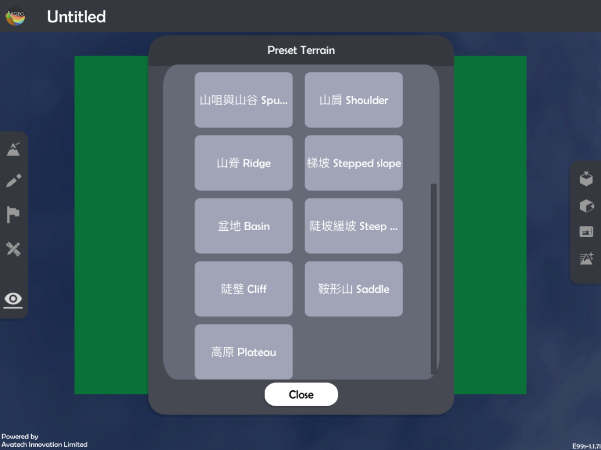
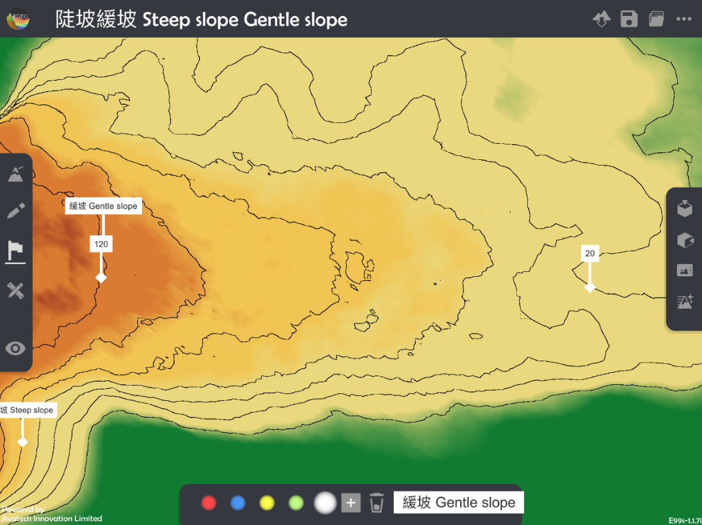
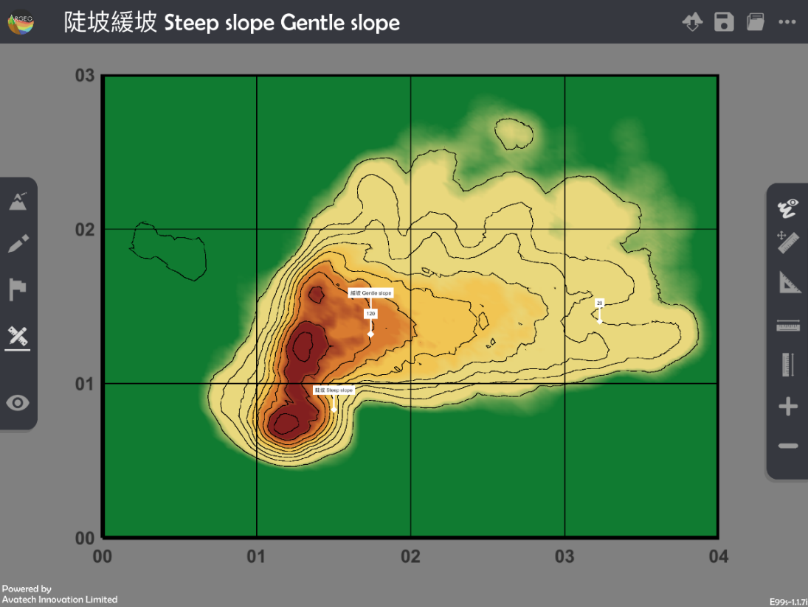
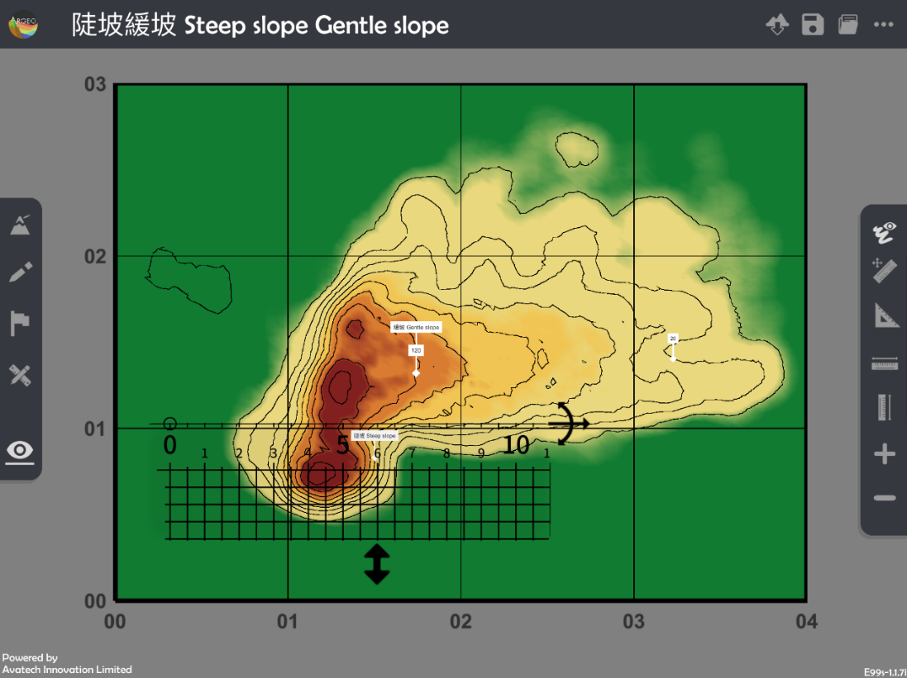
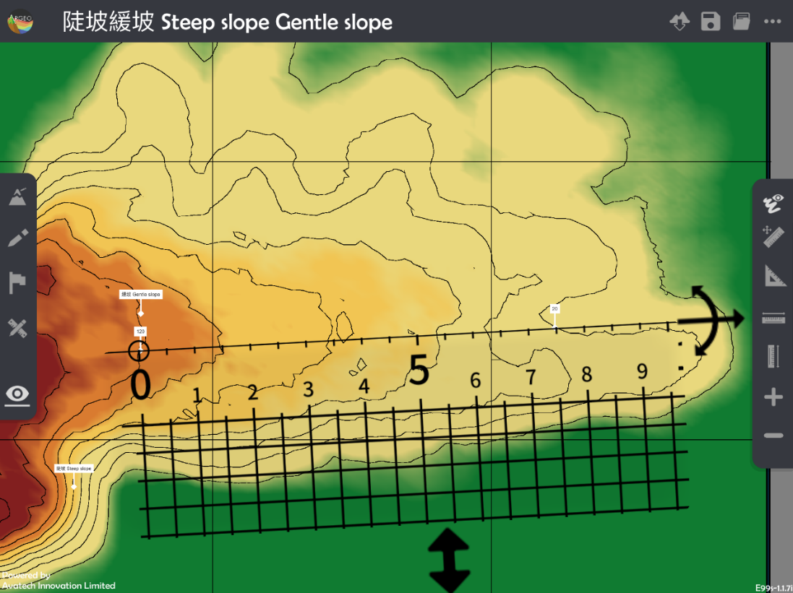

坡度 Gradient
===================================

.. |preset_terrain| image:: gradient_images/preset_terrain.png
   :width: 30

.. |terrain_edit_mode| image:: gradient_images/terrain_edit_mode.png
   :width: 30

.. |label| image:: gradient_images/label.png
   :width: 30

.. |mapview| image:: gradient_images/mapview.png
   :width: 30

教學指引
*********

以下示範如何以 ARGEO Portable 教導坡度單元。

The following demonstration shows the teaching procedures of Gradient by using ARGEO Portable.

a. 選擇一個有斜坡的「預設地形 (Preset Terrain) |preset_terrain|」或使用「地形塑造 |terrain_edit_mode|」功能建設一個斜坡，以下以「陡坡緩坡Steep slope Gentle slope」為例子。
   
   Select a slope from “Preset Terrain |preset_terrain|” or use “Terrain Modifying |terrain_edit_mode|” function to form a slope. The following example is “陡坡緩坡Steep slope Gentle slope”. 

b. 使用「標記工具 |label|」在斜坡上標記兩點並寫上正確的高度。

   Apply“Labelling Tools |label|”to mark two points on the slope and state the correct height.

老師可以使用「環境調整 |environment_options|」調校垂直間距。

Teacher can apply “Environment Option |environment_options|”to adjuct the vertical interva

.. |environment_options| image:: gradient_images/environment_options.png
   :width: 30

c. 計算兩點的垂直距離。

   Calculate the vertical distance of two objects.

d. 使用「地圖介面 |mapview|」。

   Apply “Map View |mapview|".

e. 按「呼喚直尺 |get_ruler|」以顯示直尺在熒幕上。

   Apply “Get Ruler |get_ruler|” to show the ruler on the screen.

f. 放置和調校直尺在兩點標記上以量度直線水平距離。 
   
   Place and adjust the ruler on the objects to measure the straight-line horizontal distance. 
 

g. 計算坡度。 

   Calculate the gradient.

下載教學資源
***************
教學指引
`按此下載 <https://drive.google.com/file/d/19kp5-xxI0uoDpC6wKb2ozvDhCzYjOY9c/view?usp=sharing>`_

工作紙及答案(中文版)
`按此下載 <https://drive.google.com/drive/folders/1-XFwKDM6wJ3b9bkNE6hLAVLOA4tpytVP?usp=sharing>`_

工作紙及答案(英文版)
`按此下載 <https://drive.google.com/drive/folders/1NFPbJSBwv4nIPcX3-oBLdfH2WeGiNXPm?usp=sharing>`_