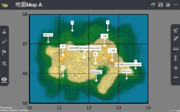
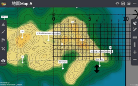
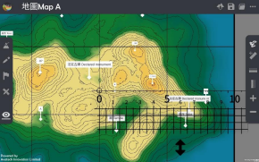
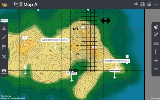

格網座標 Grid Reference 
===================================

.. |preset_terrain| image:: grid_reference_images/preset_terrain.png
   :width: 30

.. |mapview| image:: grid_reference_images/mapview.png
   :width: 30

.. |horizontal_ruler| image:: grid_reference_images/horizontal_ruler.png
   :width: 30

.. |vertical_ruler| image:: grid_reference_images/vertical_ruler.png
   :width: 30

教學指引
*********

以下示範為如何以 ARGEO Portable 教授格網座標單元

The following demonstration shows the teaching procedures of Grid Reference by using ARGEO Portable. 

a. 在「預設地形（Preset Terrain）|preset_terrain|」中選擇「地圖 A」。
   
   Select “Map A” in “Preset Terrain |preset_terrain| ”. 

b. 使用「地圖介面（Map view）|mapview| 」，可見格網線顯示在地圖上。

   Apply the “Map view |mapview|”. The grid lines are shown on the map. 

c. 按一下格網線數字，設定北行線是由 10 開始，東行線是由 65 開始（老師可因應需要自行調整格網線數 字）。 

   Press the grid line value. Set the starting point of northings is 10 and that of eastings is 65. (Teacher can  customise the grid line values.)  

d. 找出 B 點的六位格網座標 

   Find the six-figure grid reference of point B.

方法一 Method 1

e. 將整把直尺放在格網方格 6711 內。先由左至右數格仔，再由下至上數格仔（第一格為 0，最後一格為 9），記錄六位格網座標。 

   Place the ruler on the grid square. Count the grids from left to right, then from bottom to top (The first grid is 0 and  the last grid is 9). Take the readings to form six-figure grid reference. 

方法二 Method 2 

f. 按下「水平直尺（Horizontal ruler）|horizontal_ruler| 」按鈕，把直尺水平放在 B 點上，令直尺與北行線平行。 

   Press the “Horizontal ruler |horizontal_ruler|” button. Place the ruler on the point B and make it parallel to the northings. 

g. 直尺上每 0.5 厘米為一小格，由左至右第一格為 0，最後一格為 9，記錄東行線座標。 

   Each grid equals to 0.5 cm. The first grid is 0 and the last grid is 9. Take the reading of easting.

h. 按下「垂直直尺（Vertical ruler）|vertical_ruler|」按鈕，把直尺水平放在 B 點上，令直尺與東行線平行。

   Press the “Vertical ruler |vertical_ruler|” button. Place the ruler on the point B and make it parallel to the eastings.

i. 直尺上每 0.5 厘米為一小格，由下至上第一格為 0，最後一格為 9，記錄北行線座標。

   Each grid equals to 0.5 cm. The first grid is 0 and the last grid is 9. Take the reading of northing. 

.. image:: grid_reference_images/grid reference4.png
  :width: 600
  :alt: 登入畫面

j. 將東行線和北行線座標組合，成為六位格網座標。

   Combine the easting and northing readings to form a six-figure grid reference

下載教學資源
***************
教學指引
`按此下載 <https://drive.google.com/file/d/1ybrH-kOdVbjibZeJE5mFdPVlFdQPBJjL/view?usp=sharing>`_

工作紙及答案(中文版)
`按此下載 <https://drive.google.com/drive/folders/17X3eHlA2yE2jvBB5eFTd2iQ05chh_UkP?usp=sharing>`_

工作紙及答案(英文版)
`按此下載 <https://drive.google.com/drive/folders/1Hjg0CU7RWYMLQbXq5YUbtK3CF-OMaihT?usp=sharing>`_