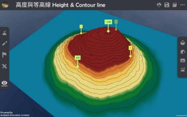

高度與等高線 Height & Contour line  
===================================

.. |preset_terrain| image:: height & contour line_images/preset_terrain.png
   :width: 30

.. |terrain_edit_mode| image:: height & contour line_images/terrain_edit_mode.png
   :width: 30

教學指引
*********

以下示範為如何以 ARGEO Portable 教授高度與等高線單元 

The following demonstration shows the teaching procedures of Height & Contour line by using ARGEO Portable. 

a. 在「預設地形（Preset Terrain）|preset_terrain|」中，選擇「高度與等高線」。
   
   Apply the “Preset terrain |preset_terrain|” function. Select “Height & Contour line”. 

b. 在「環境調整（Environment Options）|terrain_edit_mode|」中調節「垂直間距（Vertical Interval）」至 40。 

   Adjust the “Vertical Interval” to 40 on the “Environment Options |terrain_edit_mode|”. 

.. image:: height & contour line_images/height & contour line1.png
  :width: 600
  :alt: 登入畫面

c. 利用已預設的高程點及其他等高線指示，找出 A 點、B 點和 C 點的高度。

   Refer to the information provided on the map. Find the height of point A, B and C.  

d. 老師可以再塑造更多地形教導學生。
   
   Teachers can create more landforms for teaching. 

下載教學資源
***************
教學指引
`按此下載 <https://drive.google.com/file/d/1-oSkAR-pfz0bR5fphi0kq0SEHqdhJEc0/view?usp=sharing>`_

工作紙及答案(中文版)
`按此下載 <https://drive.google.com/drive/folders/1evydDGNfzUdUHAvcW9IYECk5D_iOhi38?usp=sharing>`_

工作紙及答案(英文版)
`按此下載 <https://drive.google.com/drive/folders/1vu-qVJFd6_6pDEEsrE4tI3_1OL4k5VS0?usp=sharing>`_