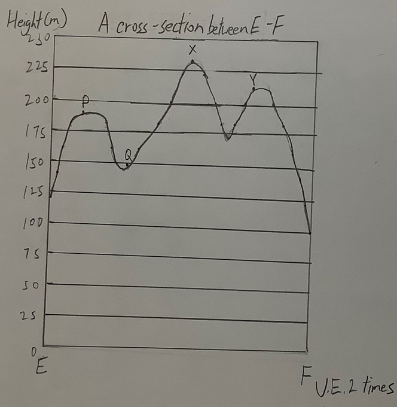
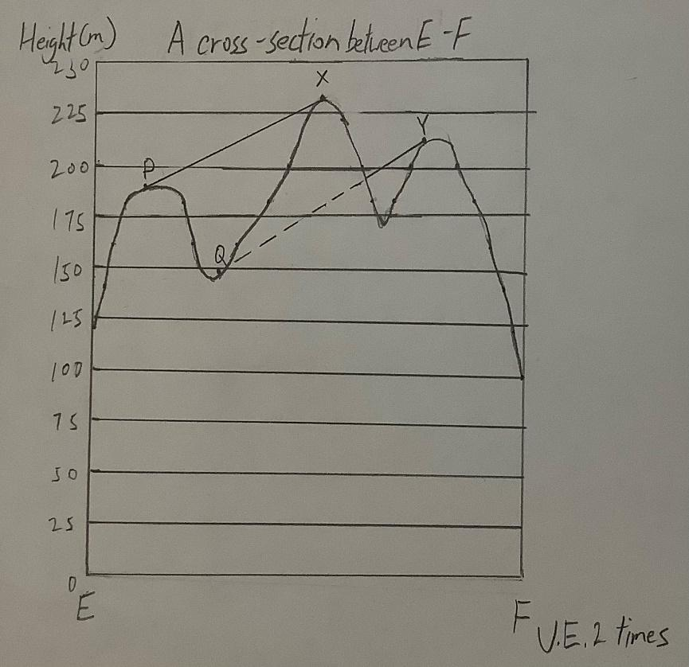

互見度 Intervisibility
===================================

以下示範如何以 ARGEO Portable 教導互見度單元。

The following demonstration shows the teaching procedures of intervisibility by using ARGEO Portable.

a. 選擇一個「預設地形(Preset Terrain) |presetterrain|」或使用「地形塑造 |terrain_edit_mode|」功能建設一個地形，以下以在「地圖Map C Preset Terrain」分辨E點到F點的互見度為例子。
   
   Select a landform from “Preset Terrain” |presetterrain| or use “Terrain Modifying” |terrain_edit_mode| function to create a landform. The following example is to determine the intervisibility of point E to F in “地圖Map C Preset Terrain”.

.. image:: intervisibility_images/intervisibility1.png
  :width: 600
  :alt: 登入畫面

b. 繪畫E點到F點的橫切面圖。（參閱橫切面指引）

   Draw the cross-section between point E to F. (Refer to cross-section guideline)

c. 分辨橫切面圖中的兩點是否互見。

   Determine the two points in the cross-section are visible or not.

