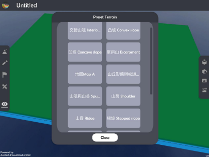
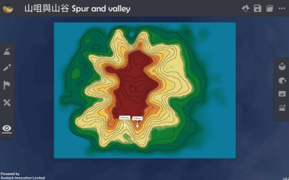
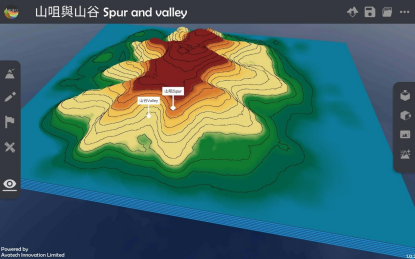
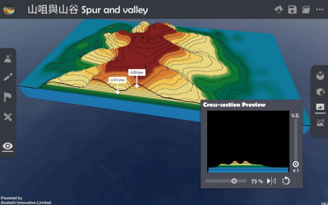
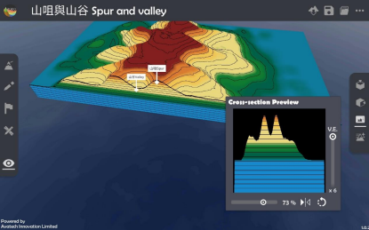

地形 Relief
===================================

.. |preset_terrain| image:: relief_images/preset_terrain.png
   :width: 30

.. |topview| image:: relief_images/topview.png
   :width: 30

.. |viewmode| image:: relief_images/viewmode.png
   :width: 30

.. |cross_section| image:: relief_images/cross_section.png
   :width: 30

教學指引
*********

以下示範如何以 ARGEO Portable 教導地形單元。 

The following demonstration shows the teaching procedures of Relief by using  ARGEO Portable.  

a. 選擇一個「預設地形（Preset Terrain）|preset_terrain|」，並選擇想教授的地形，以下以 選擇「山咀與山谷 Spur and valley」為例子。
   
   Select a relief which you want to teach in “Preset Terrain |preset_terrain|”. The following example is “山咀與山谷 Spur and valley”. 

b. 使用「俯視角度 |topview|」功能觀察地形的等高線。 

   Use“Top View |topview| ”function to observe the contour line of the relief.

c. 選擇「觀察模式 |viewmode| 」調校視角以觀察地形。

   Use“View Mode |viewmode|”to adjust the camera to observe the relief. 

d. 選擇「橫切面 |cross_section| 」功能，並以滑桿標調校橫切面至合適的位置。
   
   Use “Cross-section |cross_section|”function and adjust the slider to the suitable position.

調校垂直誇大率觀察橫切面圖。 

Adjuct the vertical exaggeration to observe the cross-section.

下載教學資源
***************
教學指引
`按此下載 <https://drive.google.com/file/d/1Tj_ijsdVTe9D6oBr8S_JW2Sdn6DNBf18/view?usp=sharing>`_

工作紙及答案(中文版)
`按此下載 <https://drive.google.com/drive/folders/1HkUXNRGgrk73h6h1_Oj8GT5MC5jjGNWT?usp=sharing>`_

工作紙及答案(英文版)
`按此下載 <https://drive.google.com/drive/folders/19Q_KMspOaGp83fJk713zMUCbfws-vhCs?usp=sharing>`_
