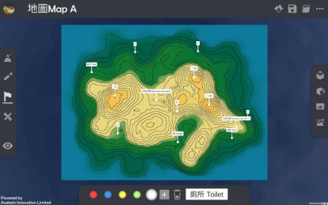
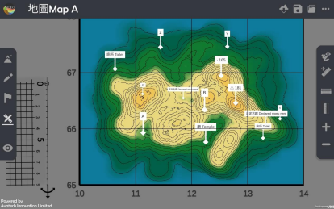
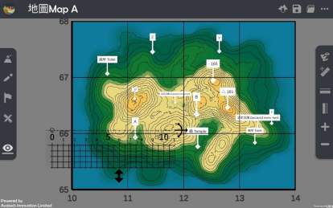
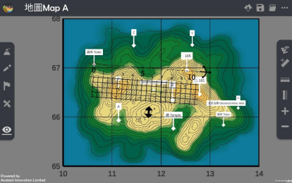

直線距離 Straight-line distance 
===================================

.. |preset_terrain| image:: straight_line_distance_images/preset_terrain.png
   :width: 30

.. |terrain_edit_mode| image:: straight_line_distance_images/terrain_edit_mode.png
   :width: 30

.. |mapview| image:: straight_line_distance_images/mapview.png
   :width: 30

教學指引
*********

以下示範如何以 ARGEO Portable 教導直線距離單元。 

a. 選擇一個「預設地形 (Preset Terrain) |preset_terrain|」或使用「地形塑造 |terrain_edit_mode| 」功能建設 一個地形，以下以「地圖 Map A」為例子。
   
.. image:: straight_line_distance_images/straight_line_distance1.png
  :width: 600
  :alt: Alternative text

b. 使用「標記工具 |label|」在地形上標記

c. 使用「地圖介面 |mapview| 」

d. 按「取得直尺」以顯示直尺在熒幕上。 
   

e. 放置和調校直尺在兩點標記上，以下以量度廁所（格網座標 106670）與高程點 165（格網座標 125669）為例子。 

計算直線距離。

下載教學資源
***************
教學指引
`按此下載 <https://drive.google.com/file/d/1X8VxnZuft8cLTGL66m_V6eu9OWkhAicI/view?usp=sharing>`_

工作紙及答案(中文版)
`按此下載 <https://drive.google.com/drive/folders/1QLrHqutPkC75cZDduW7OddyihZDEGRwD?usp=sharing>`_

工作紙及答案(英文版)
`按此下載 <https://drive.google.com/drive/folders/1BmOVN-a5ZIyu6qyDqe3RaOYsik9lxPNq?usp=sharing>`_

