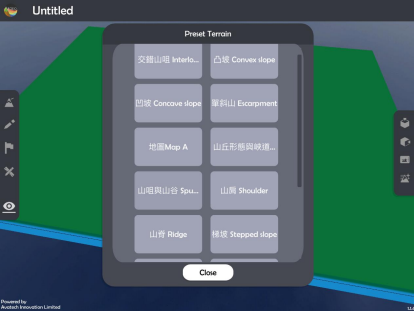

直線距離 Straight-line distance 
===================================

.. |preset_terrain| image:: straight-line distance_images/preset_terrain.png
   :width: 30

.. |terrain_edit_mode| image:: straight-line distance_images/terrain_edit_mode.png
   :width: 30

.. |mapview| image:: straight-line distance_images/mapview.png
   :width: 30

教學指引
*********

以下示範如何以 ARGEO Portable 教導直線距離單元。 

The following demonstration shows the teaching procedures of Straight-line distance  by using ARGEO Portable. 

a. 選擇一個「預設地形 (Preset Terrain) |preset_terrain|」或使用「地形塑造 |terrain_edit_mode| 」功能建設 一個地形，以下以「地圖 Map A」為例子。
   
   Select a “Preset Terrain |preset_terrain|” or use “Terrain Modifying |terrain_edit_mode|” function to form a  terrain. The following example is “地圖 Map A”. 

b. 使用「標記工具 |label|」在地形上標記

   Apply “Labelling Tools |label|” to mark two points on the terrain.

.. image:: straight-line distance_images/straight-line distance2.png
  :width: 600
  :alt: 登入畫面

c. 使用「地圖介面 |mapview| 」

   Apply “Map View |mapview|”. 

.. image:: straight-line distance_images/straight-line distance3.png
  :width: 600
  :alt: 登入畫面

d. 按「取得直尺」以顯示直尺在熒幕上。 
   
   Apply “Get Ruler” to show the ruler on the screen.

.. image:: straight-line distance_images/straight-line distance4.png
  :width: 600
  :alt: 登入畫面

e. 放置和調校直尺在兩點標記上，以下以量度廁所（格網座標 106670）與高程點 165（格網座標 125669）為例子。 

   Place and adjust the ruler on the two points. The following example is to measure the distance between toilet (106670) and spot height 165 (125669). 

.. image:: straight-line distance_images/straight-line distance5.png
  :width: 600
  :alt: 登入畫面

計算直線距離。

Calculate the straight-line distance.

下載教學資源
***************
教學指引
`按此下載 <https://drive.google.com/file/d/1X8VxnZuft8cLTGL66m_V6eu9OWkhAicI/view?usp=sharing>`_

工作紙及答案(中文版)
`按此下載 <https://drive.google.com/drive/folders/1QLrHqutPkC75cZDduW7OddyihZDEGRwD?usp=sharing>`_

工作紙及答案(英文版)
`按此下載 <https://drive.google.com/drive/folders/1BmOVN-a5ZIyu6qyDqe3RaOYsik9lxPNq?usp=sharing>`_

