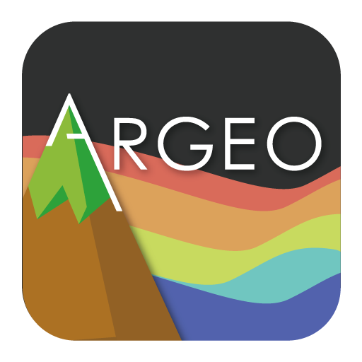
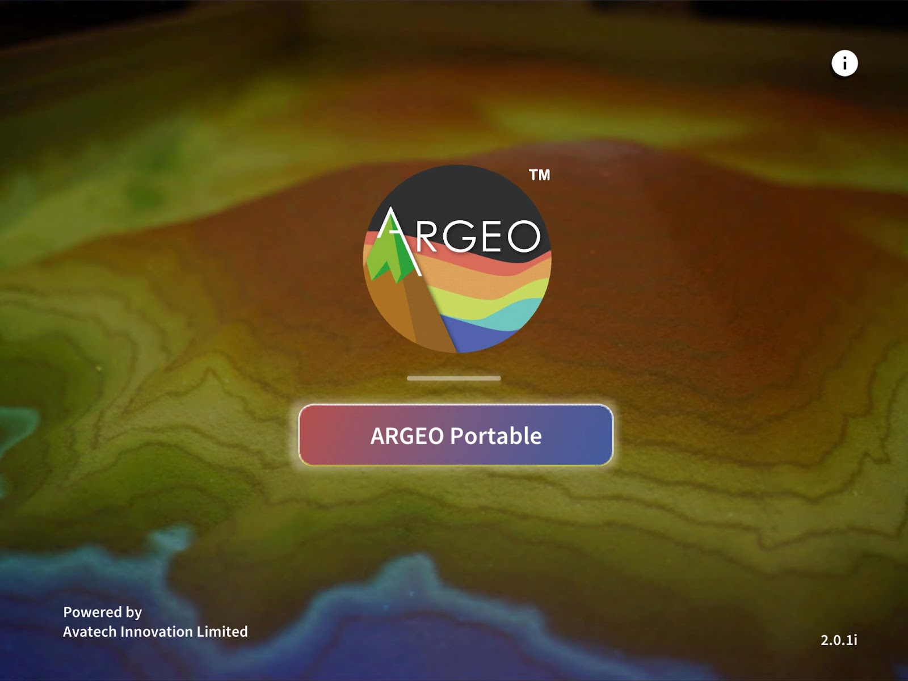

歡迎來到 ARGERO Portable 應用程式教學資源中心!
===================================

**ARGEO Portable** 是一個結合地理教學資源的應用程式，透過地形塑造，模擬出真實立體地理環境。同時，新版本加入了班級管理系統，分開教師帳戶及學生帳戶，而所有空間則會儲存於雲端系統內，使用過程中需保持網絡連接。供老師分享螢幕到 ZOOM/GOOGLE MEET 等遙距教學應用程式幫助老師進行遠程教學。

.. raw:: html

    

        <iframe width="560" height="315" src="https://www.youtube.com/embed/GRfcndb1FOY" title="YouTube video player" frameborder="0" allow="accelerometer; autoplay; clipboard-write; encrypted-media; gyroscope; picture-in-picture" allowfullscreen></iframe>
    

取得 ARGEO Portable 應用程式
===================================

  
1. 於 `Android Play Store`_ 或 `IOS App Store`_ 下載本應用程式。

.. _`Android Play Store`: https://play.google.com/store/apps/details?id=com.avatech.argeoportable

.. _`IOS App Store`: https://apps.apple.com/hk/app/argeo-portable/id1528658752

2. 下載完成後打開 ARGEO Portable 應用程式，進入以下的畫面。

.. note::
 
   此項目仍正開發當中，如有錯誤，敬請諒解.
   
目錄
--------
.. toctree::
    :maxdepth: 2
    :caption: 使用手冊:

   about
   usermanual/index

.. toctree::
    :maxdepth: 1
    :caption: 

   eduresource/index
