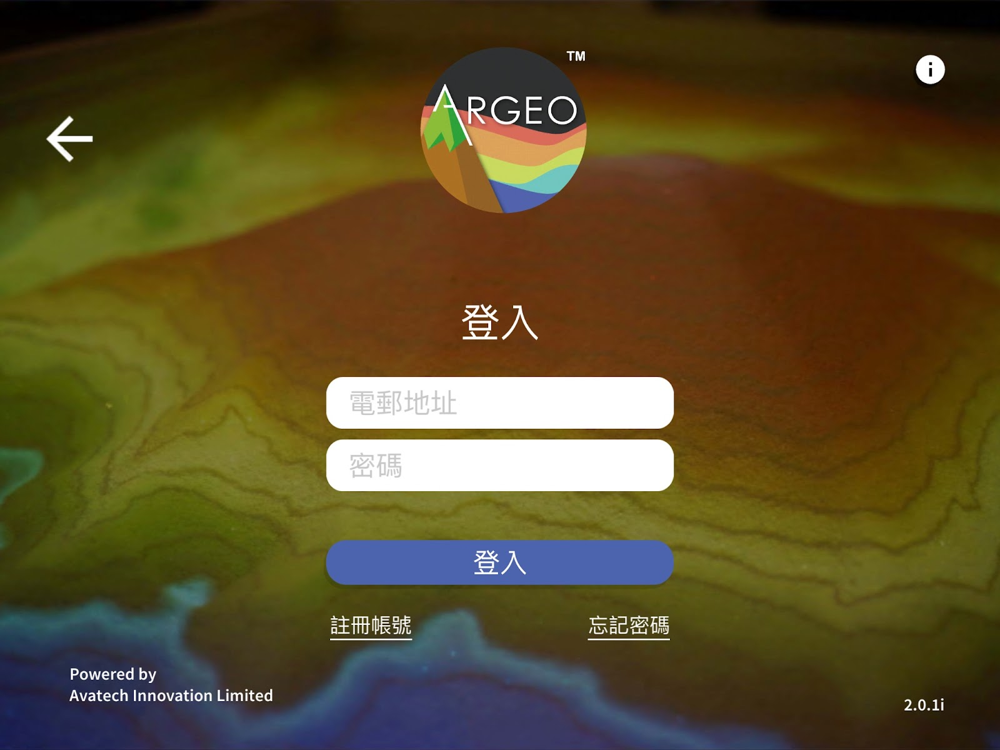
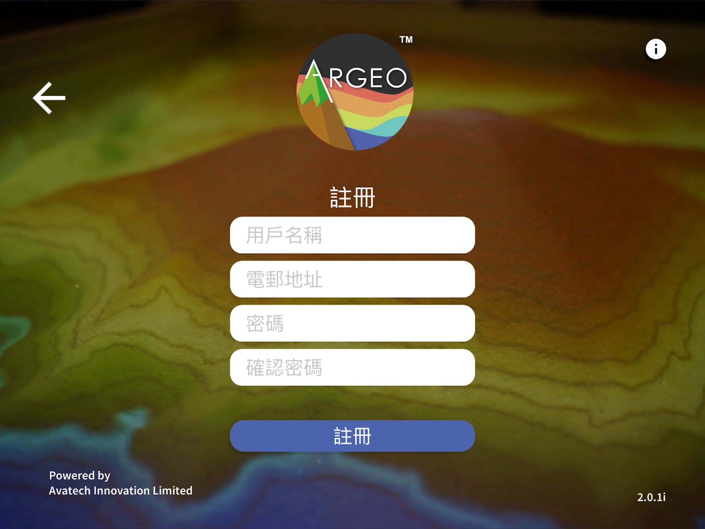
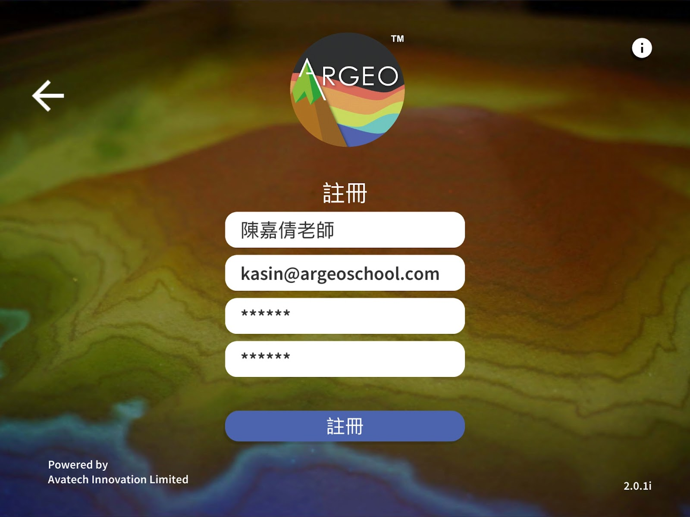
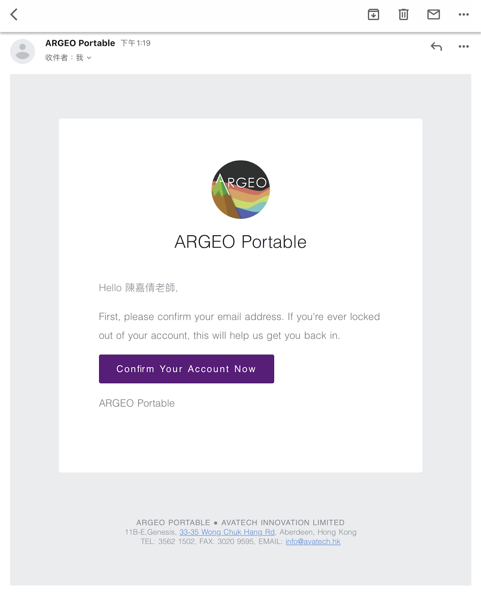
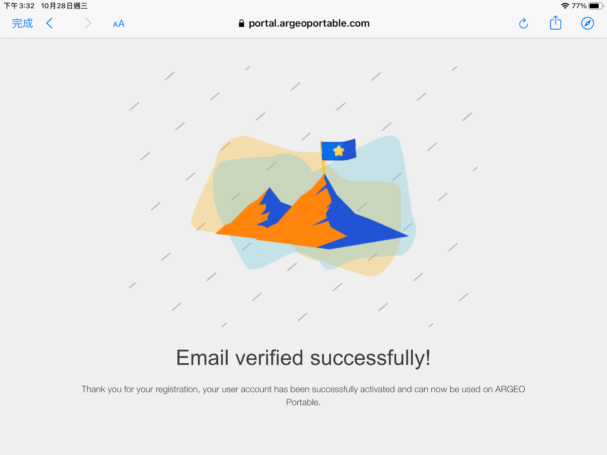
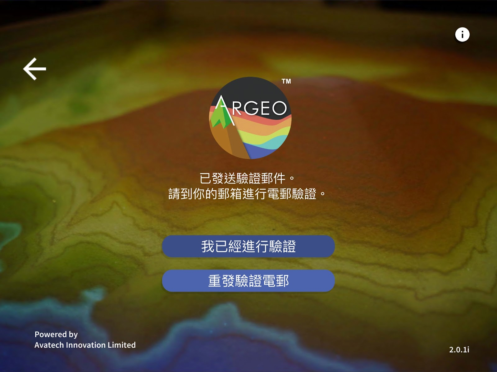
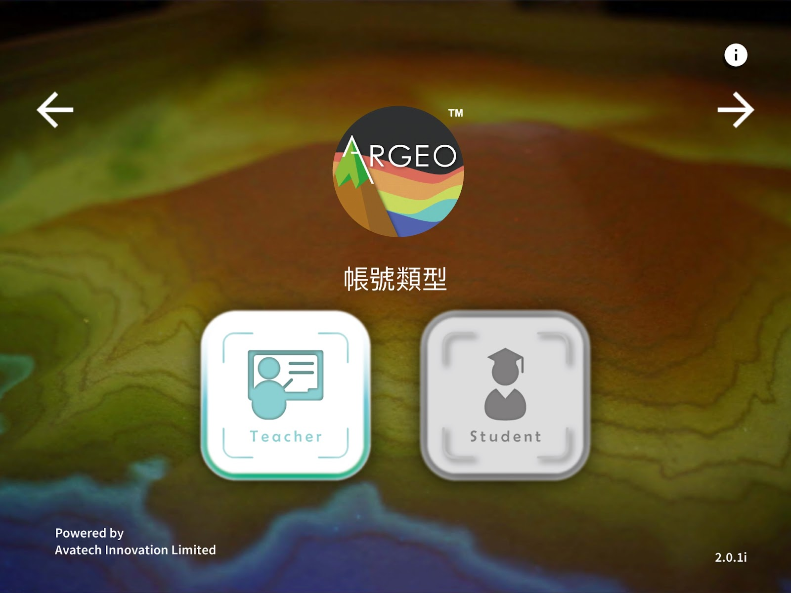
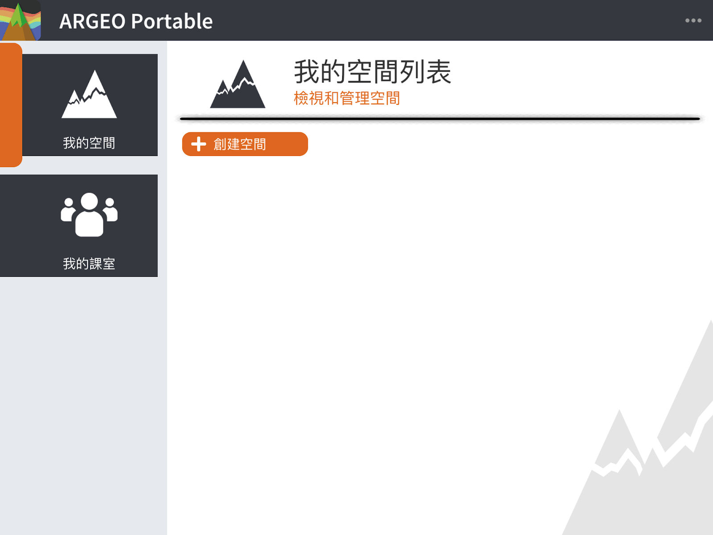
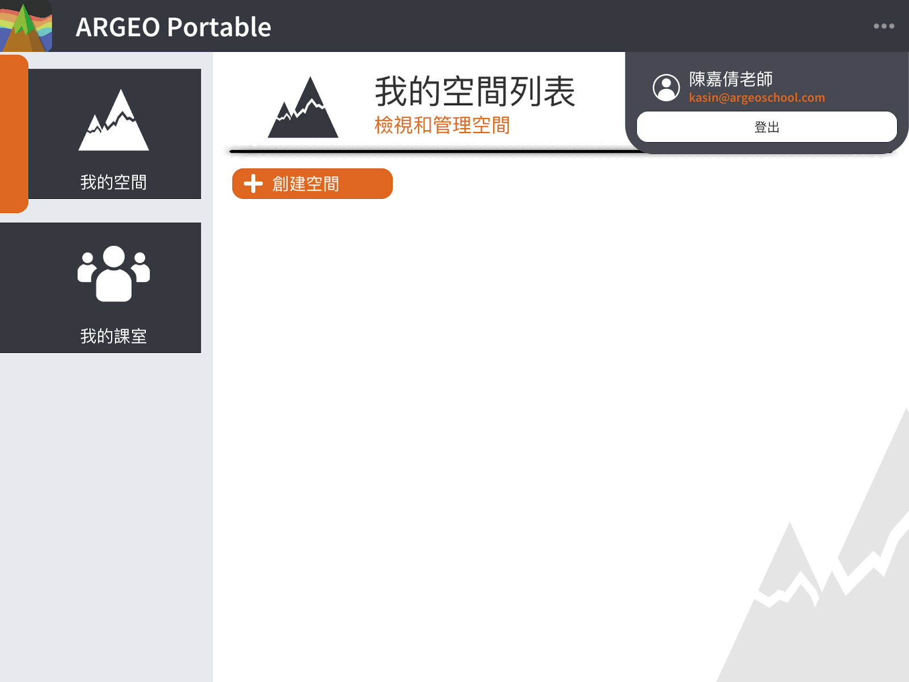
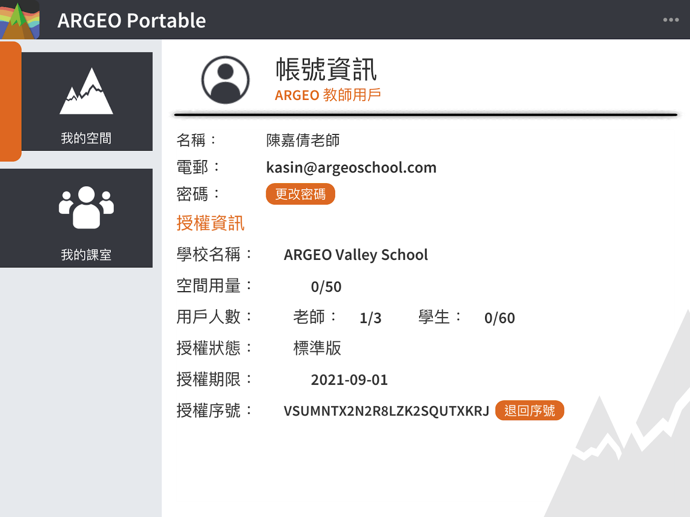

帳戶
===================================

註冊帳戶
-----------------------
按下［註冊帳號］連結

註冊帳戶：輸入用戶名稱（日後可更改）、電郵地址、密碼及確認密碼
	- 用戶名稱可由中文或英文組成
	- 請輸入一個真實的電郵地址，稍後會用作驗證用途
	- 密碼可由英文、數字或符號組成，密碼長度最少為６個字元
	- 確認密碼：輸入多一次密碼

註冊成功後請查閱電郵進行電郵驗證，在電郵中按下［Confirm Your Account Now］

  

然後返回 ARGEO Portable 應用程式，並按下［我已經進行驗證］

啟動教師帳戶
-----------------------
當電郵驗證完成後，請選擇帳號類型為教師（Teacher），然後按下一步，並輸入許可證序號。
	－許可證序號由官方系統進行派發，如未獲得許可證序號，請聯絡我們

.. image:: account_images/accountreg7.jpg
  :width: 600
  :alt: Alternative text

確認後載入以下畫面代表許可證成功啟動

啟動學生帳戶
-----------------------
當電郵驗證完成後，請選擇帳號類型為學生（Student），然後按下一步，並輸入班級邀請碼。
- 班級邀請碼由教師帳號建立班級而自動產生

確認後載入以下畫面代表成功進入班級

查看帳戶資訊
-----------------------
點選右上方［．．．］按鈕，再按下個人名稱一欄，便可查看帳號資訊，包括學校名稱、用戶人數、許可證序號、許可證到期日等資訊。
您可分享許可證序號給另一位教師作啟動教師帳戶，使用同一許可證序號啟動後，系統會自動把該名教師帳戶加入您的許可證，而用戶人數亦會自動增加。

**許可證用量計算方法**
**用戶人數**
用戶人數根據許可證計劃而定，分別是教師用戶人數及學生用戶人數。
教師用戶人數根據教師帳戶成功啟動許可證而計算，若教師用戶離開了許可證則不計算在內。
學生用戶人數根據學生帳戶成功加入班級而計算，即使學生帳戶加入多個班級也只會佔用一個學生用戶人數，若學生帳戶離開了許可證則不計算在內。

**更多資訊**：我的班級－教師帳戶－離開許可證；我的班級－教師帳戶－移除學生許可證權限
空間用量
空間用量根據許可證計劃而定，分別是教師空間用量及學生空間用量。如已佔用的空間用量已滿，帳戶將無法再建立新的空間。

教師空間用量以「我的空間」、「黑板」及「習作」的空間總和數量而計算。空間用量以帳戶已建立的空間計算，不會與其他教師帳戶共同計算。

學生空間用量以「我的空間」及「習作」計算。

- 我的空間：空間用量以帳戶已建立的空間計算。

- 黑板：不會計算空間用量

- 習作：空間用量以帳戶的習作數量而計算。由於習作是由教師帳戶於班級內所建立的，如教師建立了一份習作，在班級內每個學生的空間用量都會因而加一。若學生的空間用量已滿，教師再新建立的習作仍然能夠分配給空間用量已滿的學生，學生仍然能夠儲存習作。唯學生不能再在「我的空間」建立空間，而學生空間用量會超額顯示。

