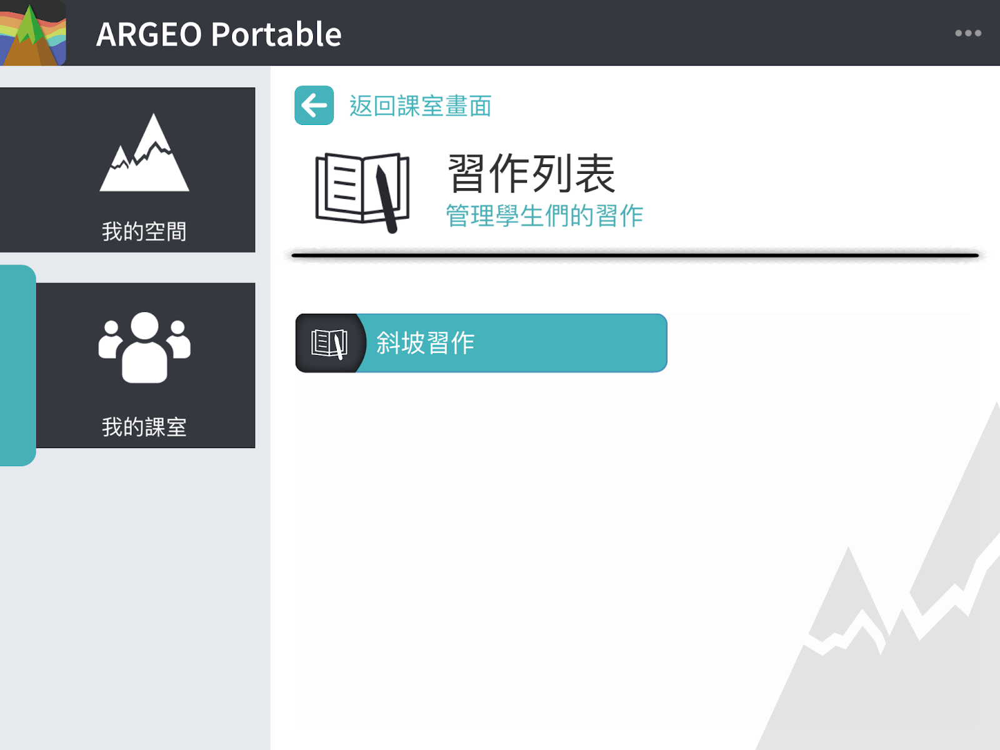

我的班級
===================================

我的班級功能簡介
-----------------------
「我的班級」讓教師帳戶建立班級，並在班級中建立黑板（筆記）及習作，然後分配給學生帳戶查看黑板及進行習作。同時，教師可查看該班級內的學生的習作及「我的空間」。教師可建立多個班級，分配不同學生進入不同班級，學生帳戶亦可同時加入多個班級。每一名教師帳戶都可查看所有屬於該許可證下班級內的黑板及習作，而學生帳戶則只能查看已加入的班級內的黑板及習作。

.. image:: path/filename.png
  :width: 400
  :alt: Alternative text

學生帳戶
-----------------------
加入新班級

點擊［＋加入班級］，輸入班級邀請碼。

.. image:: myclass_images/studentacc1.png
  :width: 400
  :alt: Alternative text

加入成功後到達班級主畫面

.. image:: myclass_images/studentacc2.png
  :width: 400
  :alt: Alternative text

查看黑板及習作

