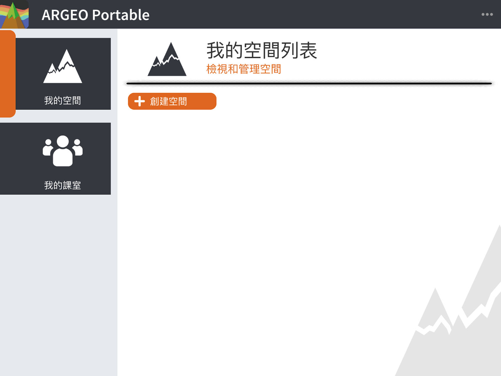
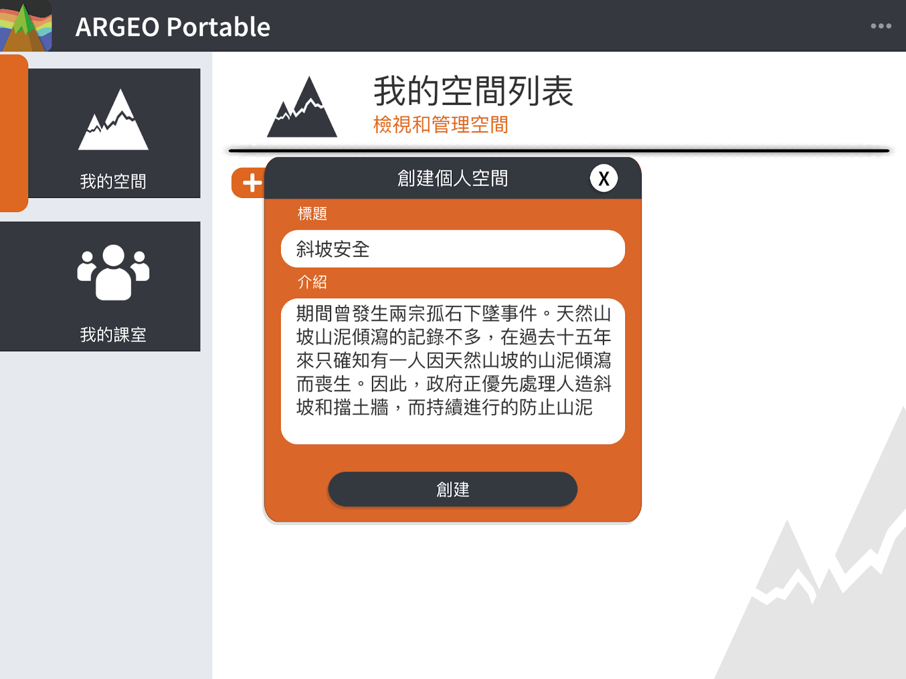
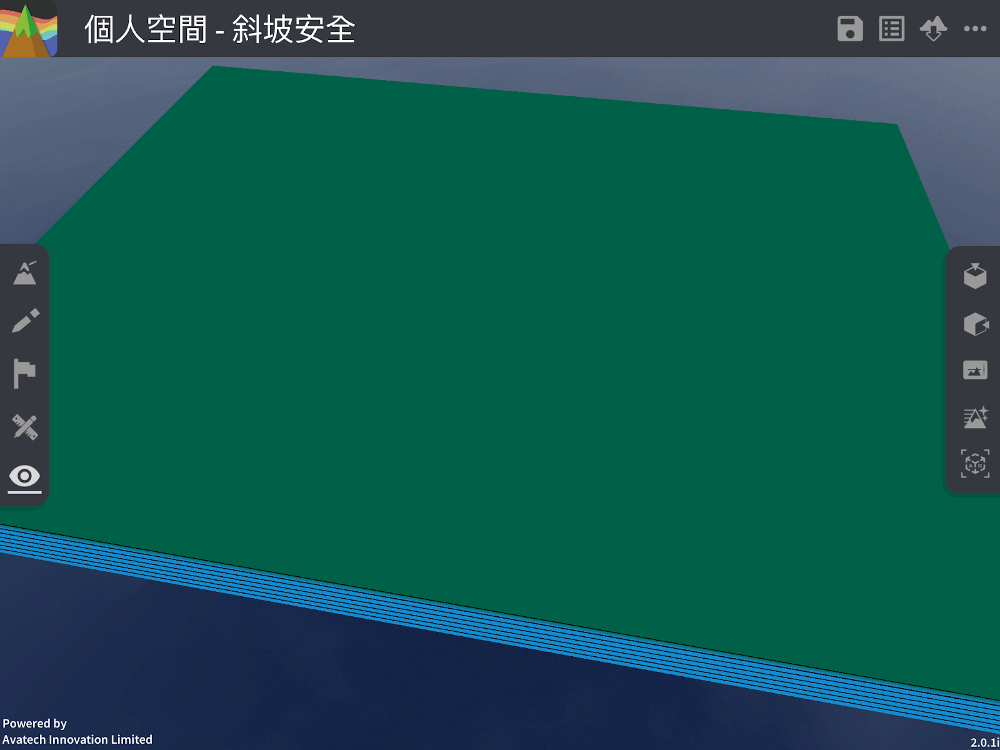
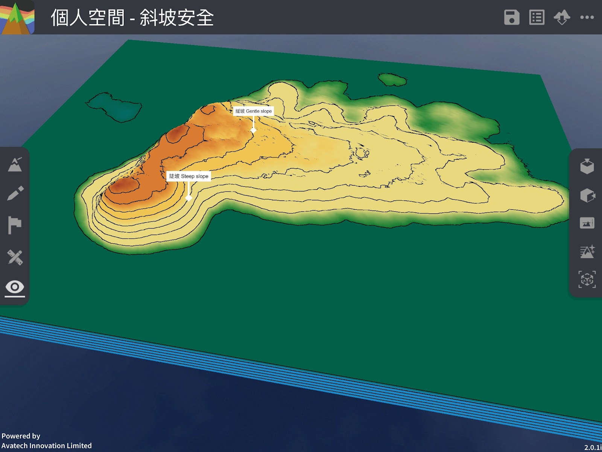
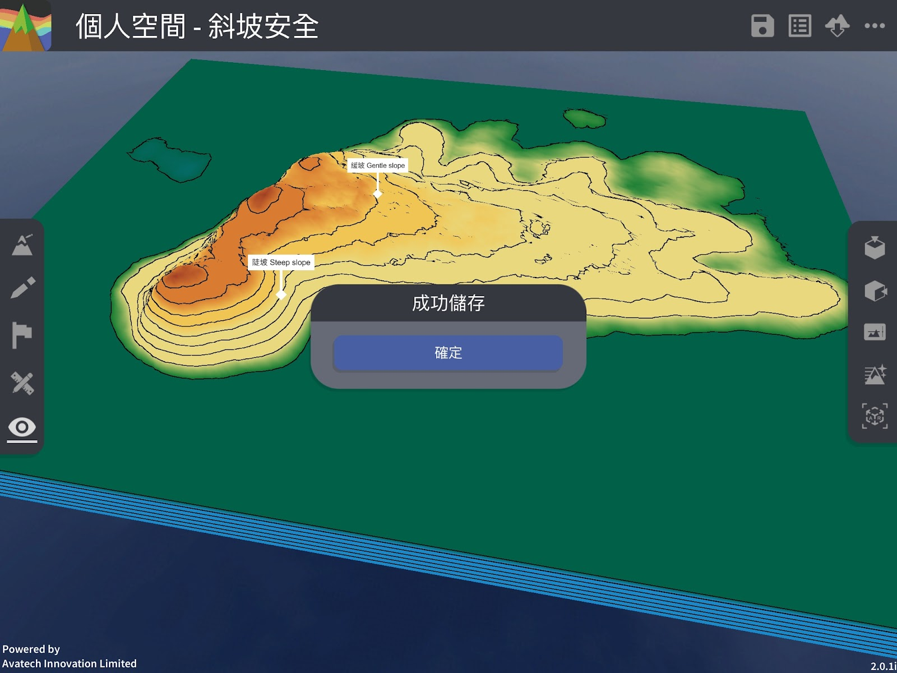
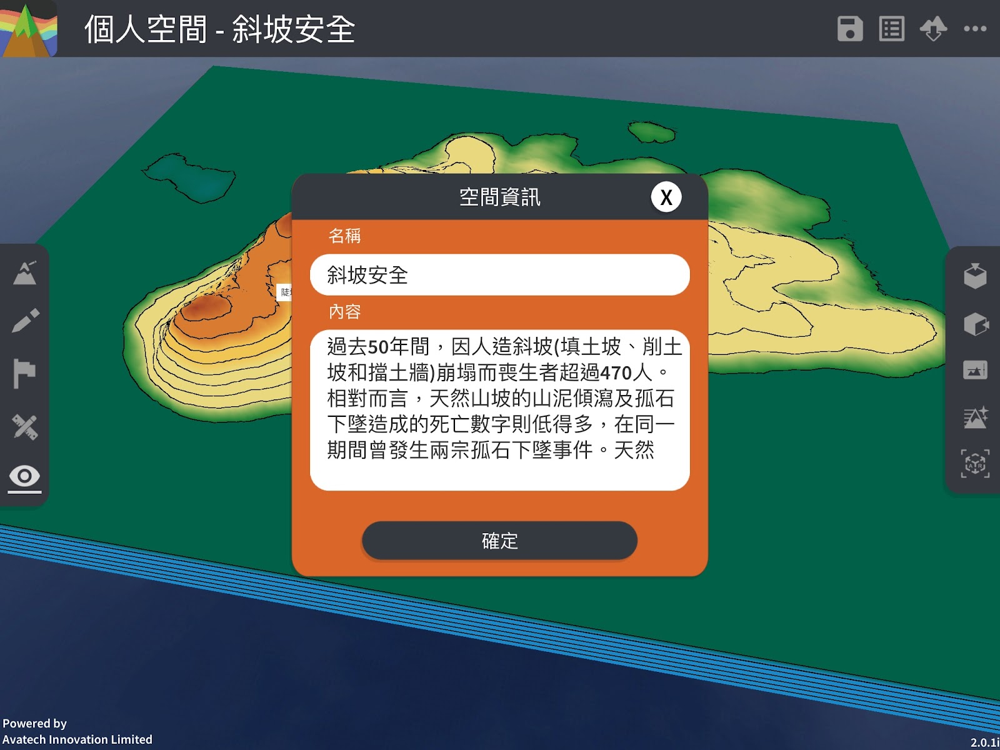
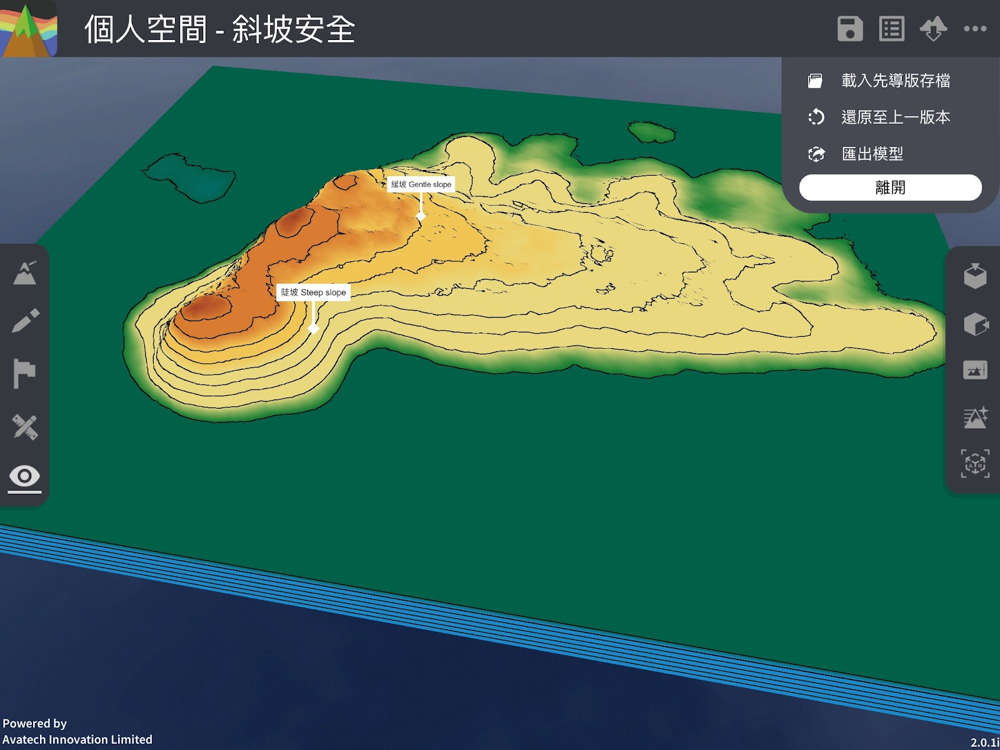
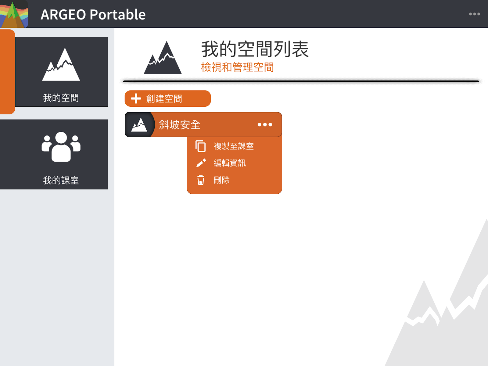

我的空間
===================================

我的空間功能簡介

「我的空間」讓用戶建立個人的地形空間，在空間裏您可使用所有編輯功能，包括地形塑造、繪圖工具、標記工具及地圖介面等，而空間會儲存於您的帳戶內。教師帳戶可查看屬於該許可證班級內的學生的「我的空間」，但不能編輯學生的空間。教師或學生帳戶是不能查看另一教師的「我的空間」，即使帳戶屬於同一許可證下。學生帳戶必須加入過班級才能使用「我的空間」。

創建我的空間
-----------------------
點擊「＋創建空間」按鈕

輸入標題（必填）及內容

點擊［創建］後便會自動進入空間，由此您可以進行編輯

編輯我的空間（儲存、查看或編輯空間資訊）
-----------------------
經過地形編輯後，您可點擊「儲存」按鈕儲存空間。同時您亦可點擊「資訊」按鈕進行查看或編輯空間資訊。

儲存空間

查看或編輯空間資訊

退出我的空間
-----------------------
點擊右上方［．．．］按鈕打開選單，在選單中按［離開］。

移除我的空間
-----------------------
點擊［．．．］打開選單，按下［刪除］按鈕

