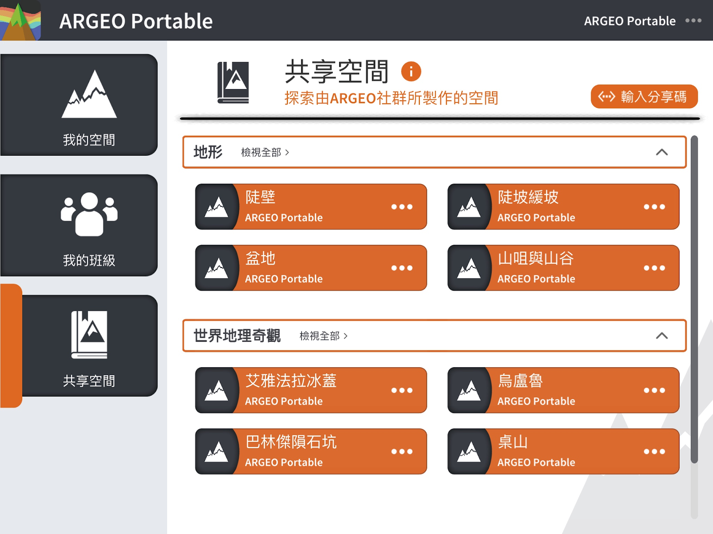
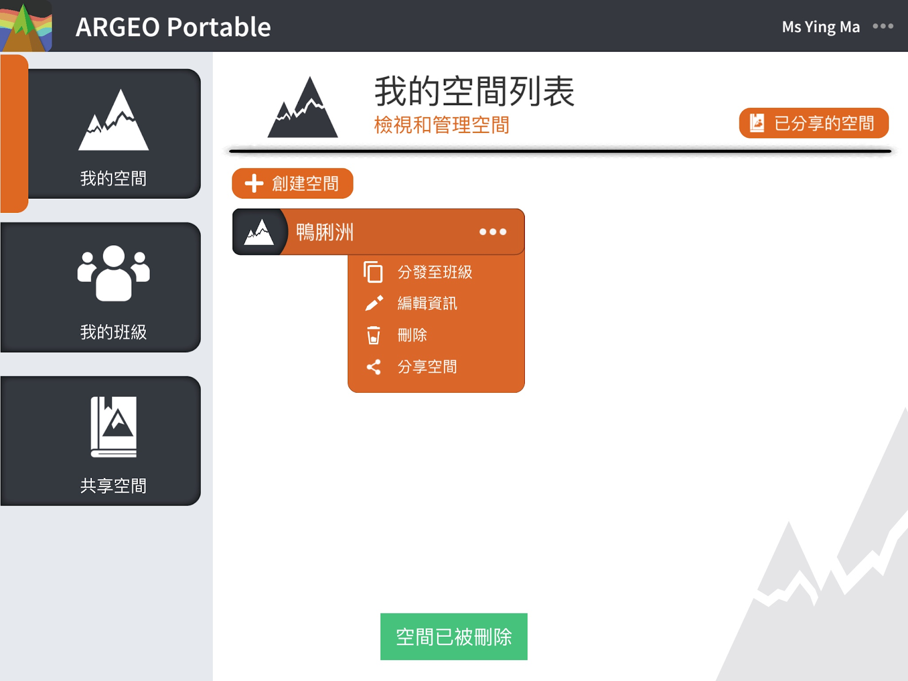
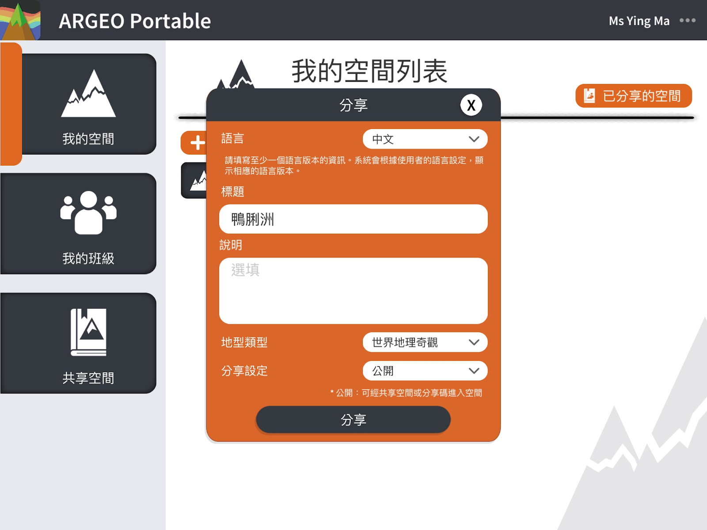
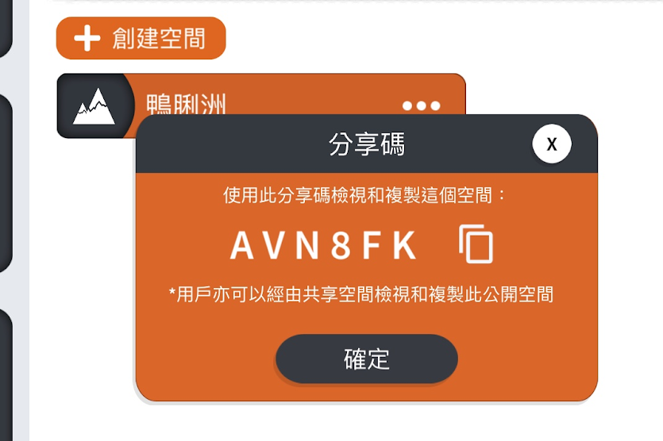
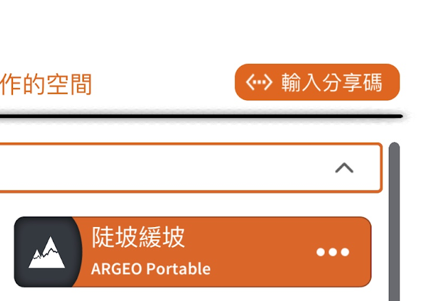
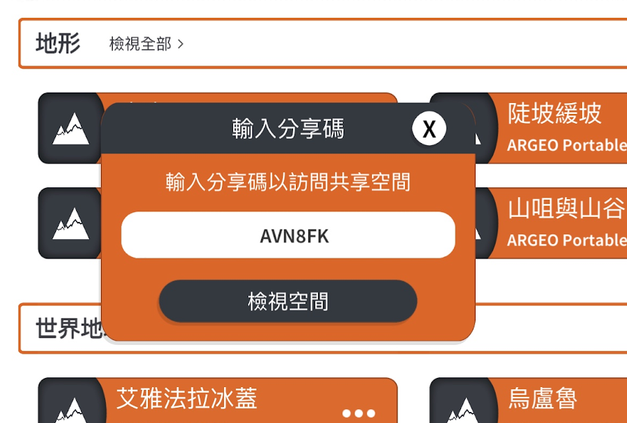
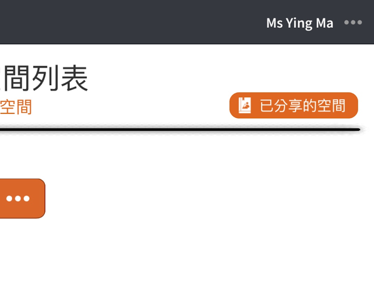
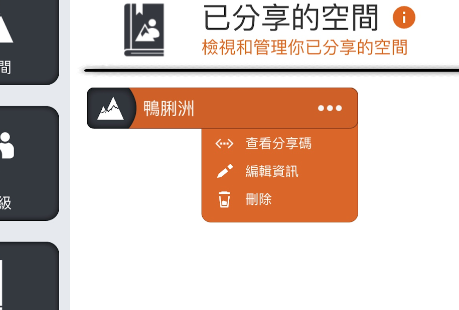

共享空間
===================================

共享空間功能簡介
-----------------------
共享空間功能讓用戶能把自己的空間分享給其他用戶，其他用戶因而能查看該空間及可取得一個空間副本以作修改，達到共享空間概念。

分享一個空間
-----------------------
在［我的空間］裏，選擇一個要分享的空間，點擊該空間的［．．．］打開選單，按下［分享］

.. image:: sharespace_images/sharespace2.png
  :width: 400
  :alt: Alternative text

輸入空間資訊：標題、說明。由於使用不同語言的用戶都可能會查看到你分享的空間，你可以分別以不同語言填寫空間資訊，讓使用不同語言的用戶都能了解你分享的空間。

類別：請選擇一個合適的類別

分享設定：你可選擇以［公開］或［不公開］形式分享空間
＊公開：可經共享空間或分享碼進入空間
＊不公開：僅可以分享碼進入空間

注意：當你把空間分享後，你將無法再修改已分享的空間的地形，你只可修改空間資訊，而已分享的空間是不會影響［我的空間］內的空間，即是你仍可編輯［我的空間］內的空間，但若你希望更新已分享的空間的地形，你必須在［我的空間］編輯地形，然後重新分享。

分享碼
-----------------------
分享完成後，系統會顯示一個分享碼，你可把分享碼傳送給其他用戶，他們便可直接查看此分享的空間

點擊［輸入分享碼］

輸入分享碼

管理我的空間
-----------------------
在你把空間分享後，你可管理你已分享的空間，包括查看分享碼、編輯資訊、刪除空間等。
在［我的空間］中，點擊［已分享的空間］

＊若你刪除已分享的空間，其他用戶便無法再在共享空間或使用分享碼查看到你的空間，而刪除已分享的空間不會影響［我的空間］內的空間